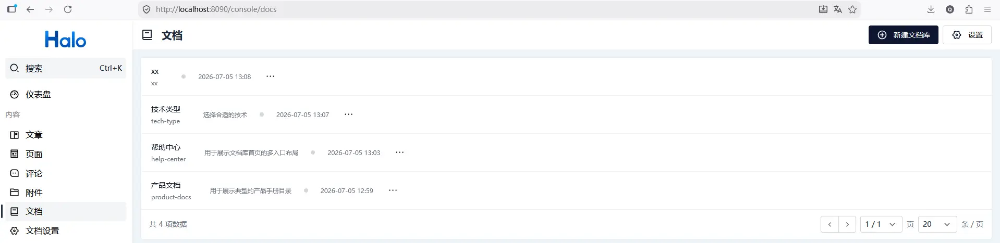
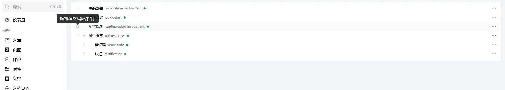
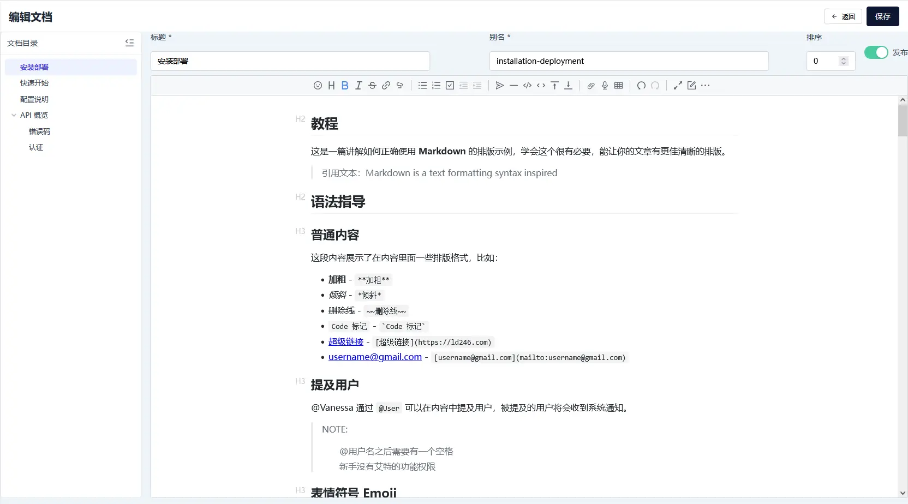
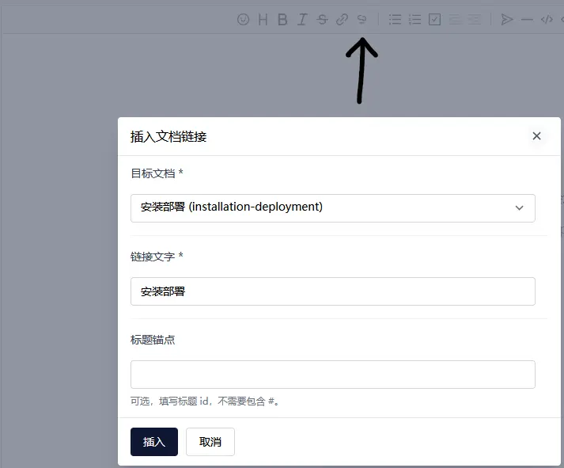
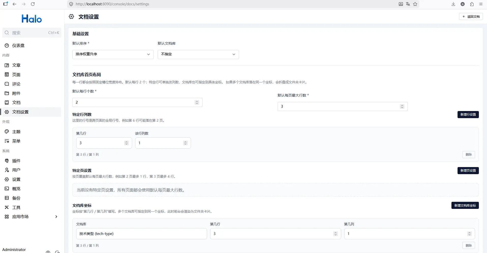
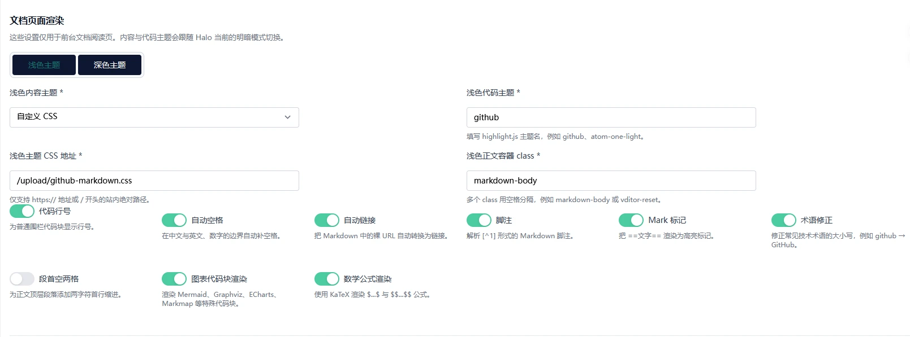
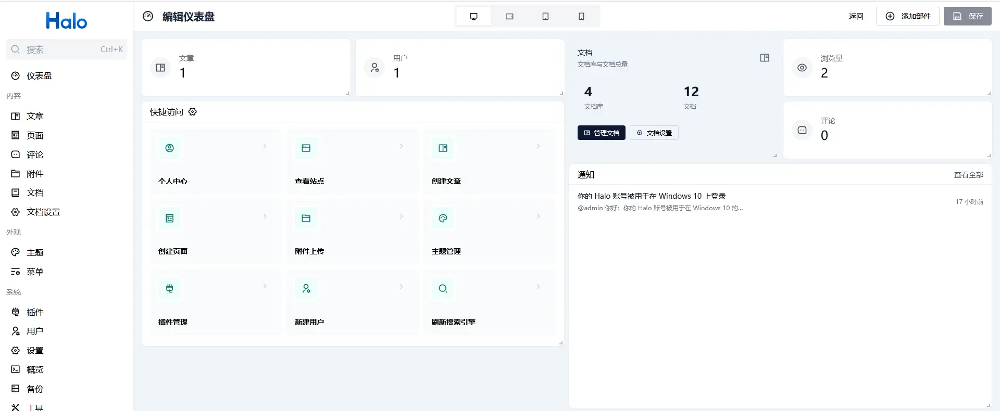
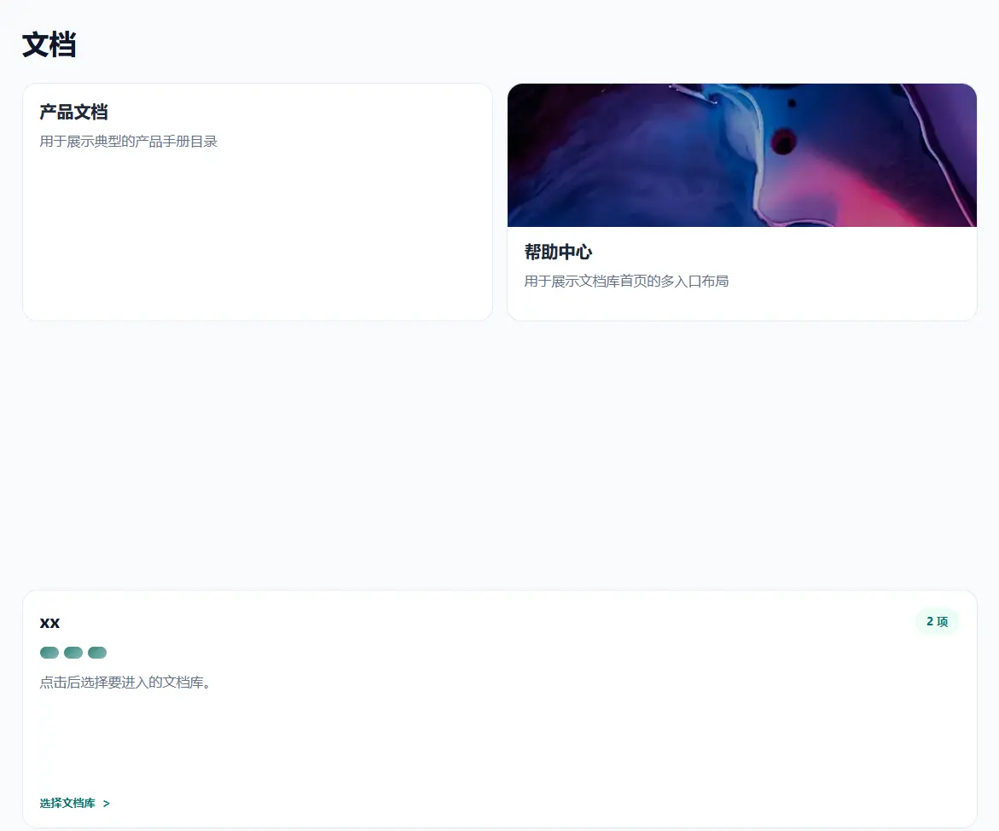
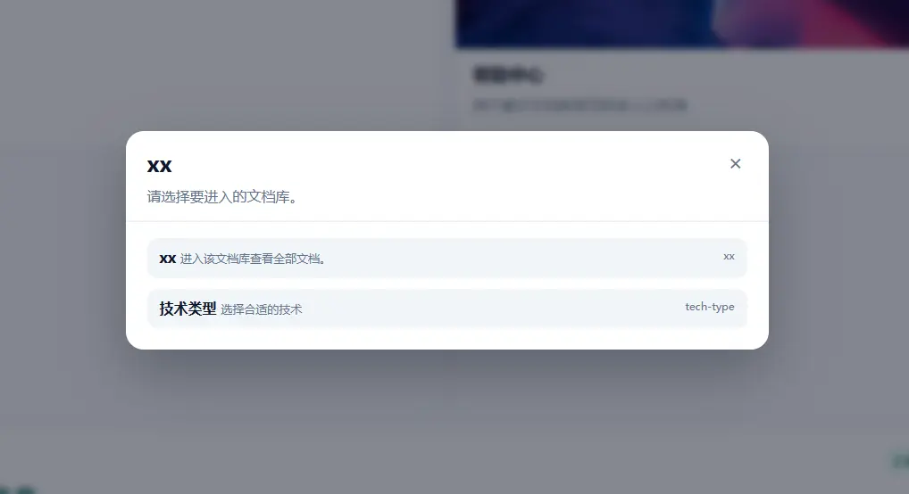
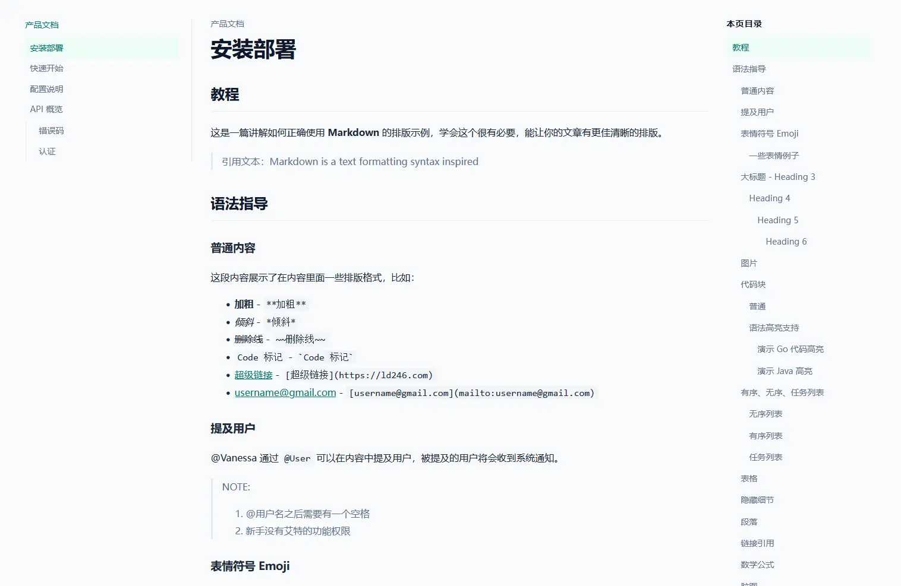

# my-docs

一个为 [Halo](https://halo.run) 提供文档 / 知识库能力的插件。

`my-docs` 在 Halo 原有文章与页面模型之外，补充一套独立的文档系统，用来承载产品手册、开发文档、帮助中心这类需要树形目录和连续阅读体验的内容。

如果你需要开发、调试、构建或发布本插件，请查看 [docs/development.md](./docs/development.md)。

## 当前能力

- 文档库管理：创建、编辑、删除文档库，支持描述与封面
- 文档管理：按文档库维护文档，支持发布状态、slug、父子层级、排序权重
- GitHub Wiki 导入：输入仓库地址由服务端拉取 Wiki，或上传 clone 后打包的 zip，自动转换 Wiki 链接并导入到新建或已有文档库
- 树形编排：在 Console 中拖拽调整目录树与同级顺序
- Markdown 编辑：使用独立 Vditor 编辑器编写 Markdown，支持从 Halo 附件库插入图片、附件与站内文档链接
- 前台展示：提供 `/docs`、`/docs/{librarySlug}`、`/docs/{librarySlug}/{docSlug}` 页面、侧边目录树，以及可配置布局的文档库首页
- 公共访问接口：仅暴露已发布文档的前台只读 API，避免泄露草稿
- 搜索与 SEO：已发布文档接入 Halo 搜索，并输出页面级 SEO 元信息
- 插件设置与仪表盘：支持默认排序、默认文档库、文档库首页布局、明暗模式独立的自定义内容 CSS 与代码主题，以及设置导出 / 加载与文档内容恢复，并提供后台统计卡片
- 文档阅读增强：支持同库文档标题短链接跳转、详情页正文大纲、滚动高亮、移动端折叠目录，以及跟随 Halo / 系统明暗模式切换内容 CSS 与代码主题；页面右上角的切换按钮可单独固定浅色或深色，选择记在浏览器本地并优先于站点与系统设置
- 自定义代码注入：支持在全局、文档库、单篇文档三个层级注入自定义 head / body 代码（HTML / CSS / JS），按 全局 → 文档库 → 文档 顺序叠加到阅读页
- 扩展点机制：对外开放 `DocContentHandler`（正文内容后处理）与 `DocDetailModelHandler`（阅读页 Model 注入）两个扩展点，其他插件可注册实现来扩展文档阅读页
- AI 辅助编写：文档设置页提供「后台代码片段」与「扩展插件开发」两段提示词一键复制，便于借助 AI 生成规范代码
- 同域媒体代理：可把指定主机上的图片、音视频地址改写为站点自身的 `/media-proxy` 地址由服务端代取，适用于对象存储桶不对外开放、附件 permalink 只是裸对象地址的情况

## 安装与使用

安装方式：

1. 从 GitHub Release 下载插件 jar。
2. 在 Halo Console 的「插件」页面上传 jar。
3. 安装并启用 `my-docs`。

启用后可直接使用：

- Halo Console 侧边栏中的「文档」与「文档设置」入口
- 前台文档首页：`/docs`
- 单个文档库页：`/docs/{librarySlug}`
- 文档详情页：`/docs/{librarySlug}/{docSlug}`

## 兼容性

- Halo `>= 2.25.0`

## GitHub Wiki 导入

在「文档库列表」页或某库的「管理文档」页点击「导入 Wiki」，支持两种来源：

- **从仓库拉取**：填写 `owner/repo` 或完整 GitHub 地址，由服务器浅克隆 `{repo}.wiki.git`
  读取页面；私有 Wiki 需填写具有读取权限的 GitHub 访问令牌（PAT）。
- **上传压缩包**：在本地执行 `git clone https://github.com/owner/repo.wiki.git` 后将目录
  打包为 zip 上传，适合服务器无法直连 GitHub 的场景。

导入行为：

- 页面文件名作为文档标题，`Home` 页排在目录最前，其余按文件名排序，全部平铺为顶层文档
- `[[Page]]`、`[[Page|文字]]`、`[[Page#锚点]]` 等 Wiki 链接自动转换为站内同库短链接；
  找不到对应页面时降级为纯文本并在导入报告中提示
- `[文字](Page.md)` 形式的普通相对链接同样按页面名大小写不敏感解析并转换，
  避免 GitHub 端链接大小写与文件名不一致导致跳转失败
- 未被导入转换的残余链接（如 HTML 链接、历史导入内容）在访问时兜底解析：
  站内页面路由按别名大小写不敏感匹配，渲染时自动剥掉 `.md` / `.markdown`
  扩展名，保证别名小写而链接带大写时同样能跳转
- `_Sidebar.md`、`_Header.md`、`_Footer.md` 等 Wiki 特殊文件自动跳过
- 可选择导入到已有文档库或新建文档库，并可指定导入后立即发布或保持草稿
- 重复导入同一 Wiki 到同一文档库时即为「从 Wiki 更新」：按别名或页面名（忽略大小写）
  匹配到的已有文档原地更新标题与正文（沿用原别名，外部链接不失效），其余按新建处理

## 文档渲染设置

文档设置页可单独配置浅色与深色模式下的 Markdown 内容 CSS、正文容器 class 和代码高亮主题。
内容样式仅支持自定义 CSS 地址，不再提供内置内容主题；例如使用 `github-markdown-css` 时，可将
容器 class 设置为 `markdown-body`。CSS 地址留空时使用插件提供的基础回退样式。

前台阅读页优先读取 Halo 主题写入页面或本地存储的明暗状态；当 Halo 主题选择 `auto` 或没有提供明确状态时，
跟随浏览器的 `prefers-color-scheme`。主题状态变化后，自定义内容 CSS、正文 class 与代码主题会在不重新生成正文 HTML 的情况下切换。

页面右上角有明暗切换按钮。点过之后就是明确的访客选择：它优先于站点主题与系统偏好，记在浏览器本地
（`localStorage` 的 `mdocs:color-scheme`），刷新后保持，也不受 Halo 主题后续变更影响；
站点主题写在根元素上的 `dark` 类或 `data-scheme="dark"` 不会把手动选择的浅色顶回深色。
想恢复跟随站点，清掉这个 localStorage 键即可。

其他渲染选项只作用于前台阅读页，不改变后台 Vditor 编辑器：

- 代码行号、自动空格、裸 URL 自动链接
- Markdown 脚注、`==文字==` Mark 标记、常见技术术语大小写修正
- 顶层正文段落首行缩进
- Mermaid、Graphviz、ECharts、Markmap 等图表代码块渲染
- `$...$` 与 `$$...$$` 数学公式渲染（RaTeX WASM + 透明 Canvas，颜色跟随正文，失败时回退 Vditor）
- 复制按钮、图片点击放大
- 视频内嵌播放：图片语法指向 `mp4` / `webm` / `m3u8` 等视频文件时渲染为内嵌播放器

## 前台插入视频

用图片语法指向视频文件即可，前台会渲染成播放器：

```markdown

```

支持 `mp4`、`webm`、`ogv`、`ogg`、`m4v`、`mov`、`m3u8`，扩展名大小写不敏感，
`?query` 与 `#fragment` 不影响判定；`m3u8` 会先加载 hls.js。写普通链接语法
（`[文字](demo.mp4)`）只会得到下载链接，不会内嵌播放器。

从后台附件库插入视频时，插件插入的也是上面这种图片语法：标签取附件的标题或文件名，
因此前台直接就是播放器，不需要手改 Markdown。

也可以用 `#md-width` / `#md-align` / `#md-pad` 控制尺寸与对齐：

```markdown

```

## 同域媒体代理

有些对象存储桶不对公网开放，Halo 附件只记录裸对象地址（例如
`https://<account>.r2.cloudflarestorage.com/xxx.webm`），浏览器直连会拿到
`400 InvalidArgument / Authorization`。开启「文档设置 → 媒体同域代理」后，
命中允许清单的图片与音视频地址会在渲染时改写成站点自身的
`/apis/api.my-docs.tsdaer.run/v1alpha1/media-proxy?src=…`，由 Halo 服务端代取，
前台只与站点同域通信，不涉及 CORS，也不需要把桶开放成公共读。

三个设置项：

- **媒体代理允许主机**：每行一个主机名，支持 `*.example.com` 通配与 `:端口`。
  只有列在这里的主机才会被代理；留空即完全关闭。
- **媒体代理附加请求头**：每行 `主机: 头名: 头值`，仅对允许清单内的主机生效，
  用于私有桶的网关凭证。主机不要带端口，头值只存在服务端，不会输出到页面。
- **媒体代理大小上限**：单个文件的上限，超过即中断。响应体在 8 MiB 以内走内存，
  更大则落临时文件流式回放，响应结束即删除。

这些设置项都在「文档设置」页的「视频与媒体代理」一节里。

需要注意的是，这个端点对访客开放，而请求头规则只按主机匹配、没有路径维度：
一旦配了凭证，任何访客都能取该主机下的任意对象，不只是文档引用过的那些。
请只把确实需要公开的媒体主机写进允许清单，凭证也请用只读、可随时吊销的那种。

## 升级建议

升级前建议先备份 Halo 数据，并在升级后检查：

- 如需迁移或回滚文档配置，可先在「文档设置」页导出当前设置与文档快照
- 文档库列表与文档树是否正常加载
- 文档编辑保存后前台是否能正常渲染
- 浅色 / 深色自定义内容 CSS、正文 class 与代码主题是否能随站点主题切换
- 自定义 Markdown CSS、代码行号、脚注、图表代码块和公式是否按设置生效
- 前台右上角的明暗切换按钮是否可用，手动选择后刷新是否保持
- 正文里的视频是否渲染为播放器（用图片语法插入视频的正常显示）
- 若开启了媒体同域代理，`/apis/api.my-docs.tsdaer.run/v1alpha1/media-proxy?src=…` 是否返回媒体内容
- `/docs`、`/docs/{librarySlug}`、`/docs/{librarySlug}/{docSlug}` 是否可访问
- 搜索是否能命中文档内容

## 界面预览

### Console 管理端

文档库列表：



文档树管理：



文档编辑页：



文档编辑页，站内文档链接插入弹窗：



文档设置页：



文档设置页，文档页面渲染配置：



仪表盘统计组件：



### 前台文档站点

文档库首页：



文档库首页，文件夹选择弹窗：



单个文档库首页页内导航布局：


文档详情页：



## 功能概览

### Console 管理端

- 侧边栏「文档」入口与「文档设置」入口
- 仪表盘文档统计组件
- 文档库列表与编辑弹窗
- 文档树管理页
- 文档编辑页（导航树 + Vditor 编辑器 + 工具栏附件库/文档链接插入）
- 文档设置页支持文档库首页布局编排：默认每行数量、默认每页最大行数、特定页行数、特定行列数、文档库坐标与文件夹标题/描述
- 文档设置页支持为浅色 / 深色模式分别配置自定义 Markdown CSS、正文容器 class 及代码高亮主题；CSS 通过 HTTPS / 站内绝对路径接入，留空时使用基础回退样式
- 文档设置页支持代码行号、自动空格、自动链接、脚注、Mark、术语修正、段首缩进、图表代码块、数学公式、复制按钮、图片放大与视频内嵌渲染
- 文档设置页支持「视频与媒体代理」一节：媒体同域代理开关、允许主机清单、附加请求头与大小上限
- 文档设置页支持导出 / 加载设置，备份内容包含插件设置、文档库与文档 Markdown 内容；加载时按快照恢复
- 文档设置页支持配置全局自定义 head / body 代码，并提供「后台代码片段」「扩展插件开发」两段 AI 提示词一键复制
- 文档库编辑弹窗与文档编辑页分别支持配置该库 / 该文档专属的自定义 head / body 代码

### 前台文档站点

- 文档库首页：`/docs`
- 单个文档库页：`/docs/{librarySlug}`
- 文档详情页：`/docs/{librarySlug}/{docSlug}`
- 文档库首页支持按全局行号跨页排布，并可在坐标冲突时显示带名称和描述的文件夹卡片，点击后弹窗选择文档库
- 文档详情页按当前设置从 Markdown 生成展示 HTML，再执行内容扩展、同库链接改写与正文大纲提取；搜索和 API 仍使用已存储的 `spec.content`
- 自定义内容 CSS、正文 class 和代码主题按浅色 / 深色模式独立配置；优先跟随 Halo 当前主题，`auto` 或无明确信号时跟随浏览器系统主题
- 内置 Vditor 展示资源由插件本地提供；第三方 Markdown CSS 由访客浏览器直接加载，加载失败时保留可读的回退样式
- 阅读页按 全局 → 文档库 → 文档 层级注入管理员配置的自定义代码，并可被其他插件通过扩展点扩展

## 许可证

[GPL-3.0](./LICENSE) © tsdaer
