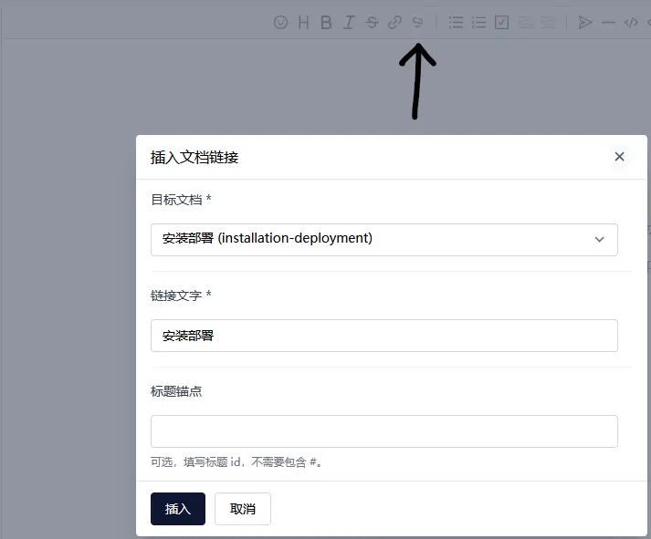
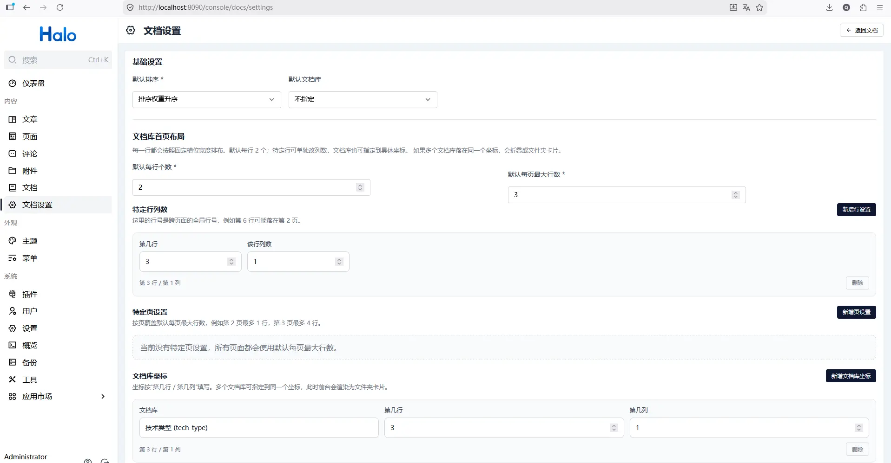
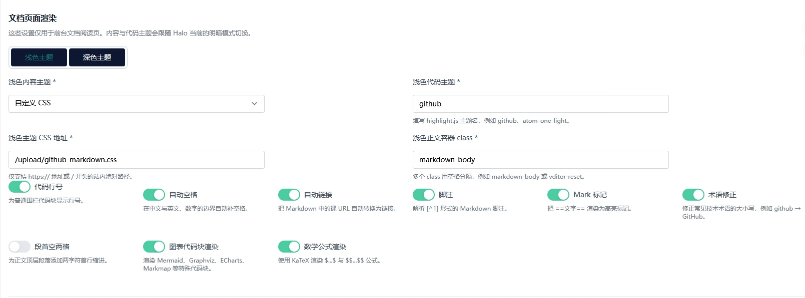
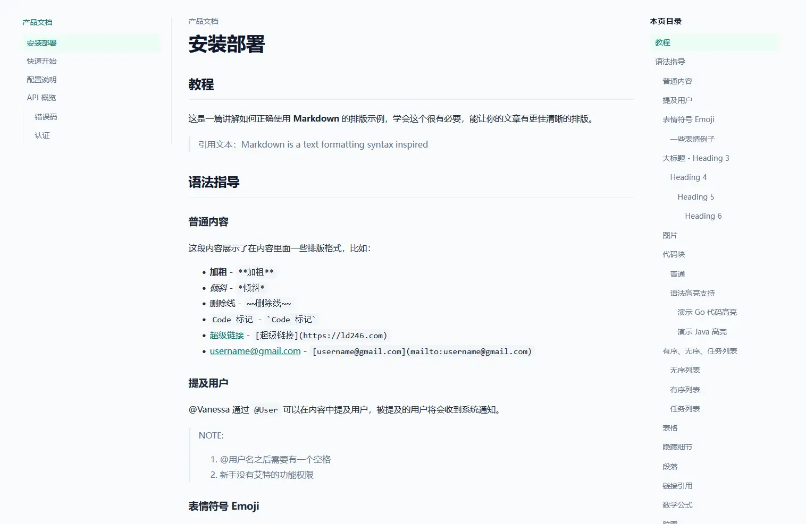

# 截图目录

本目录用于存放发布素材截图。

当前截图文件：

- `console-libraries.webp`
- `console-tree.webp`
- `console-editor-0.webp`
- `console-editor-1.webp`
- `console-editor.webp`
- `console-settings-0.webp`
- `console-settings-1.webp`
- `console-settings.webp`
- `dashboard-widget.webp`
- `site-index-0.webp`
- `site-index-1.webp`
- `site-index-2.webp`
- `site-index.webp`
- `site-detail-0.webp`
- `site-detail.webp`

具体拍摄要求见 [../screenshot-guide.md](../screenshot-guide.md)。

说明：

- 不带编号的文件用于发布主图占位
- `-0`、`-1`、`-2` 文件用于展示同一功能的不同界面状态或细节

## 预览

### Console

### Site

