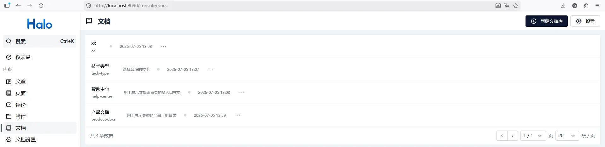
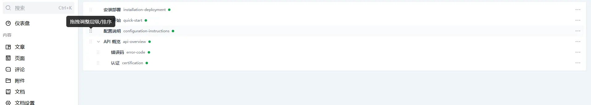
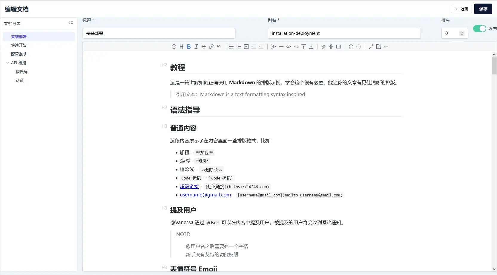
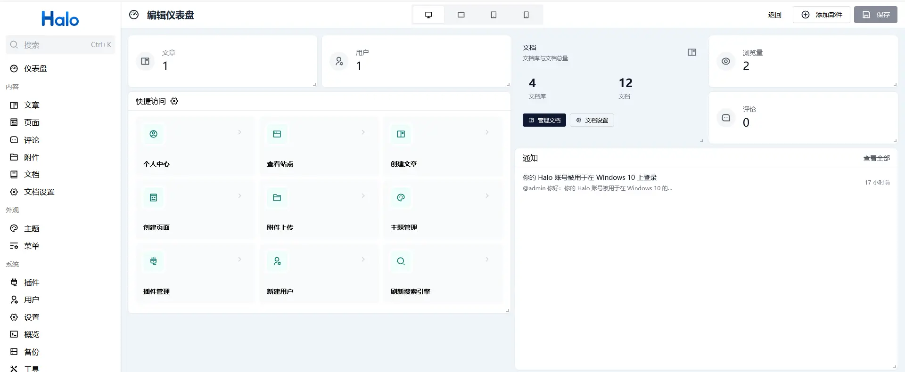

# 截图目录

本目录用于存放发布素材截图。

当前主图文件：

- `console-libraries.webp`
- `console-tree.webp`
- `console-editor.webp`
- `console-settings.webp`
- `dashboard-widget.webp`
- `site-index.webp`
- `site-detail.webp`

具体拍摄要求见 [../screenshot-guide.md](../screenshot-guide.md)。

补充截图：

- `console-editor-1.webp`：站内文档链接插入弹窗
- `console-settings-1.webp`：文档页面渲染配置区域
- `site-index-1.webp`：文档库文件夹选择弹窗
- `site-index-2.webp`：单个文档库首页页内导航布局

## 预览

### Console

### Site

